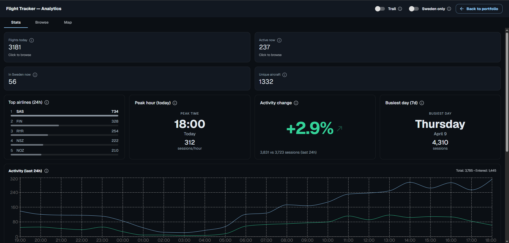
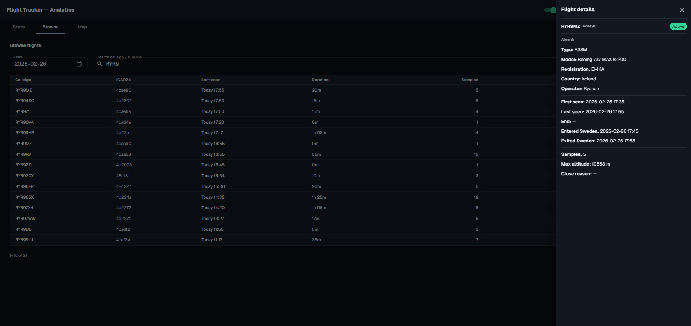

# levieriksson/portfolio

This repository contains the source code for my personal portfolio website and the featured project, **FlightTracker**, a real-time aircraft tracking and analytics application.

## Technology Stack

- **Frontend**: React, Next.js, TypeScript, MUI, MapLibre GL
- **Backend**: C#, .NET 10, ASP.NET Core
- **Data**: PostgreSQL, Entity Framework Core
- **Cloud & DevOps**: Azure (App Service, PostgreSQL Flexible Server), GitHub Actions, Bicep (IaC), Azure WebJobs

## Project: FlightTracker

FlightTracker is an end-to-end web application that ingests, processes, and displays live flight data over Sweden. It is built with a modern stack, deployed on Azure, and automated with GitHub Actions.

## Screenshots

### Live map

### Analytics

### Browse & flight details

### Architecture Overview

The application is structured as a monorepo with distinct frontend, backend, and data ingestion components.

#### Frontend (`apps/web`)

The user interface is a **Next.js 16** application built with **React 19**, **TypeScript**, and **MUI**.

- **Interactive Map**: A core feature is the live map, built using **MapLibre GL**, which displays real-time aircraft positions. It supports panning, zooming, and clicking on aircraft to view details.
- **Data Visualization**: The frontend presents aggregated statistics and allows users to browse and filter historical flight sessions.
- **UI Components**: The UI is composed of reusable React components for displaying stats, browsing data tables, and presenting information in modals and drawers.
- **Portfolio Integration**: The same Next.js application also serves as the main portfolio website, with the FlightTracker application available as an interactive preview or a full-screen experience.

#### Backend (`apps/flighttracker/flighttracker-api`)

The backend is an **ASP.NET Core API** built on **.NET 10**.

- **RESTful API**: Exposes endpoints for flights, map data, and statistics consumed by the frontend.
- **Data Access**: Uses **Entity Framework Core** with a PostgreSQL provider (`Npgsql`) to interact with the database.
- **CORS**: Configured to allow requests from the portfolio website and Vercel preview deployments.
- **Configuration**: Manages database connection strings and OpenSky API credentials through environment variables and secrets.

#### Data Ingestion (`apps/flighttracker/flighttracker-ingestor`)

Data is continuously fetched from the **OpenSky Network API**.

- **Scheduled Job**: A .NET console application is packaged as an **Azure WebJob** and configured to run on a 5-minute cron schedule (`*/5 * * * *`).
- **Data Processing**: The ingestor fetches flight state vectors for a bounding box covering Sweden. It then processes this raw data, creating or updating `FlightSession` records in the database.
- **Data Pruning**: A cleanup routine runs periodically to remove old snapshot and session data to manage database size.

### Infrastructure and Deployment (`apps/flighttracker/infra`)

The entire system is deployed to **Microsoft Azure** and managed with Infrastructure as Code.

- **Azure Resources**: The infrastructure consists of an **Azure App Service** (Linux) to host the .NET backend and a **PostgreSQL Flexible Server** for the database.
- **Bicep (IaC)**: All Azure resources are defined declaratively in Bicep files, ensuring consistent and repeatable environments.
- **CI/CD**: A comprehensive **GitHub Actions** workflow (`.github/workflows/flighttracker-prod.yml`) automates the entire deployment process:
  1.  Builds and publishes the .NET API and Ingestor projects.
  2.  Packages the Ingestor application as a triggered WebJob inside the API's deployment artifact.
  3.  Logs into Azure and provisions/updates infrastructure using the Bicep template.
  4.  Deploys the final application package to the Azure App Service.
